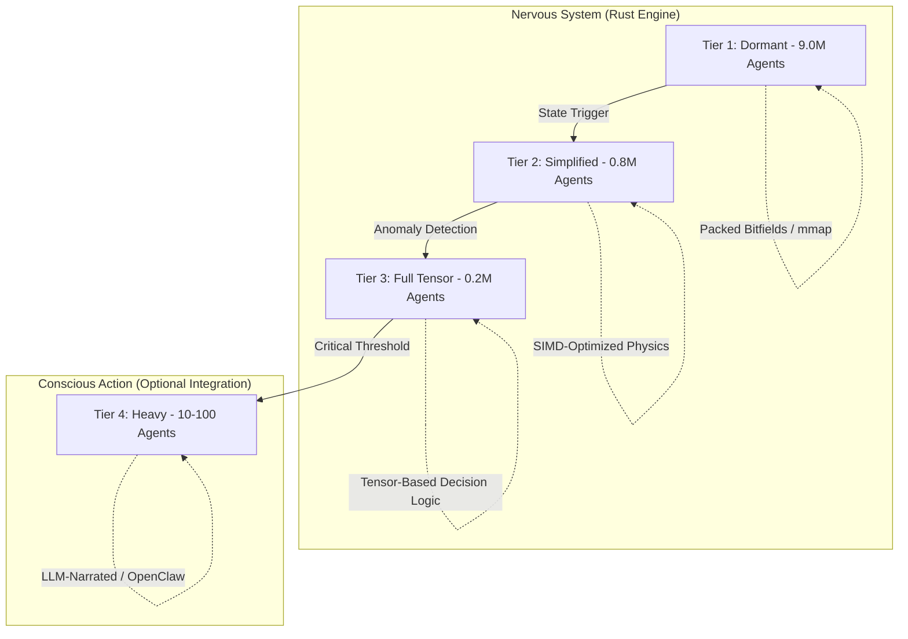

<div align="center">
  

  <h3>OpenRustSwarm</h3>

  <p>A high-performance research substrate for large-scale agent simulations.</p>

  [](https://github.com/juyterman1000/openrustswarm/actions)
  [](https://opensource.org/licenses/MIT)
  [](https://www.rust-lang.org/)
  [](https://nextjs.org/)
</div>

<p align="center">
  
</p>

---

## The Problem: Scaling Complexity in Agent Simulations

Most agent-based simulations struggle with the $O(N^2)$ neighbor lookup problem and high memory overhead per agent. When scaling to millions of entities, traditional object-oriented patterns or even standard Entity-Component-System (ECS) approaches often hit wall-clock or memory limits on consumer hardware.

OpenRustSwarm is a research project exploring how to use **Level of Detail (LOD)** strategies—common in 3D rendering but less so in agent logic—to simulate up to 10,000,000 agents on a single workstation.

## Technical Strategy: 4-Tier LOD Architecture

We categorize agents by their "Criticality" and "Surprise Score" to determine how much compute resource they consume.



### Key Optimizations

- **mmap-Backed Dormant Pool**: T1 agents are stored in a memory-mapped array with a 256-bit footprint per agent, minimizing the resident set size (RSS).
- **Spatial Hash Grid**: We use a zero-copy spatial hash for $O(1)$ neighbor queries, avoiding expensive bridge-crossing between WASM and JavaScript in browser environments.
- **SIRS Epidemiology**: Instead of basic "health," we use a Susceptible-Infected-Recovered system where "Surprise" from data volatility acts as the infectious agent.
- **Darwinian Genetics**: A custom genetic crossover engine allows for emergent behavioral shifts over thousands of generations.

---

## Performance & Benchmarks

We have verified a stable 10,000,000 agent simulation (1M active) on standard hardware with a throughput of **~20.7 Million updates per second**.

Detailed methodology, test environment specs, and instructions to reproduce these numbers can be found in [BENCHMARKS.md](BENCHMARKS.md).

---

## Use Cases

1.  **Collective Intelligence Research**: Testing how high-frequency data shocks propagate through massive populations.
2.  **Simulation Engineering**: A reference implementation for scaling PyO3/Rust simulations with `mmap`.
3.  **Visualization Tech**: Stress-testing WebGL and Instanced Rendering in Next.js/WASM environments.

---

## Quick Start

```bash
git clone https://github.com/juyterman1000/openrustswarm.git
cd openrustswarm/web
npm install
npm run dev
```

*Note: The browser demo is limited to 200,000 agents to maintain 60fps on typical mobile/web hardware.*

---

## Roadmap

- [x] **Rust Core**: Memory-mapped LOD system, spatial hash, and SIRS logic.
- [x] **Evolution**: Genetic crossover and point mutation engine.
- [x] **WASM Bridge**: High-frequency data injection from CoinGecko/GitHub.
- [ ] **Methodology Paper**: A detailed write-up of the LOD strategy for agent simulations.
- [ ] **WebAudio**: R0-driven harmonic chord synthesis.
- [ ] **Cross-Instance Sync**: Pheromone field diffusion over WebSockets.

---

## Contributing

We welcome technical contributions, especially around SIMD optimizations for the T2/T3 tiers and new data feed integrations. 

See [CONTRIBUTING.md](CONTRIBUTING.md) for architectural deep dives.

---

## License

[MIT License](LICENSE)
